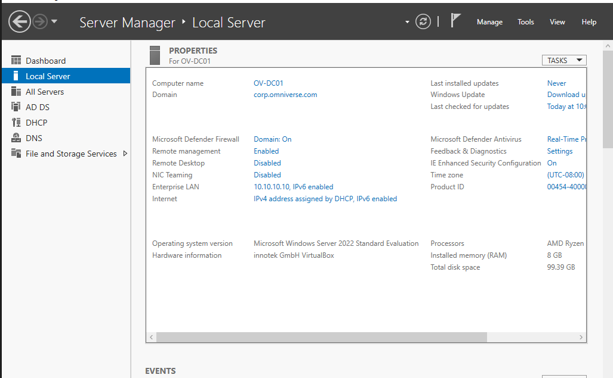
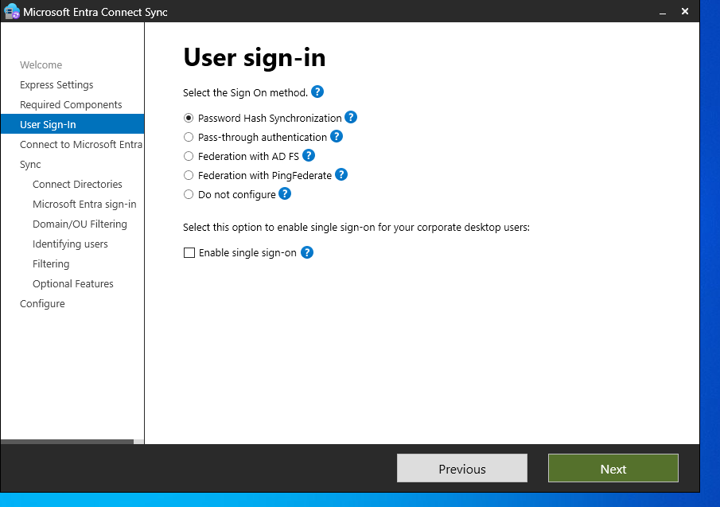
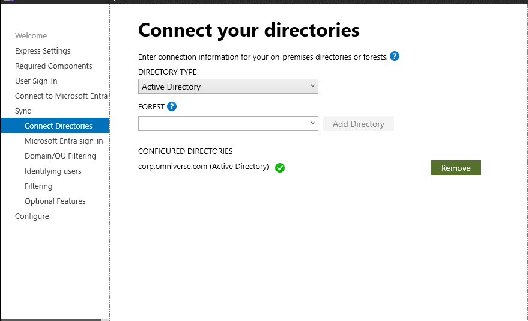
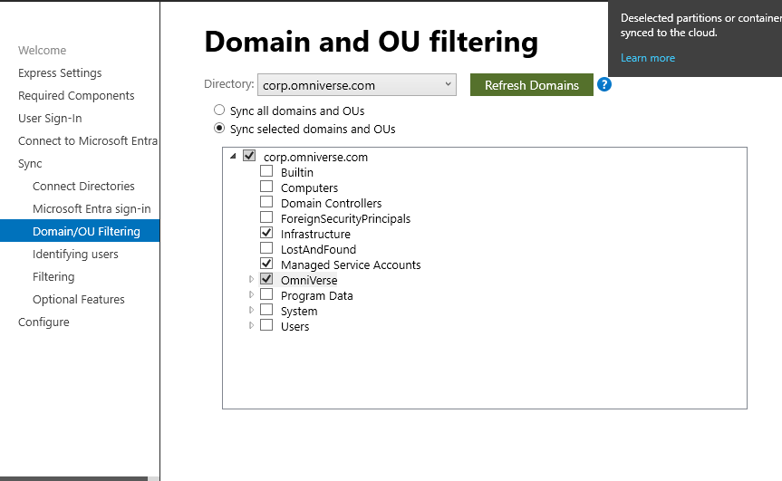
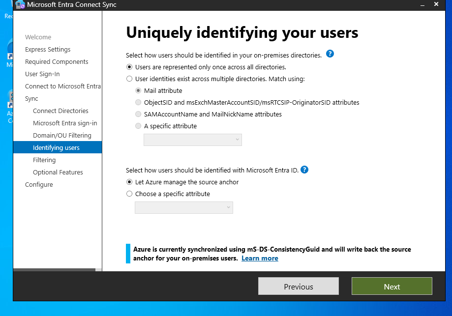
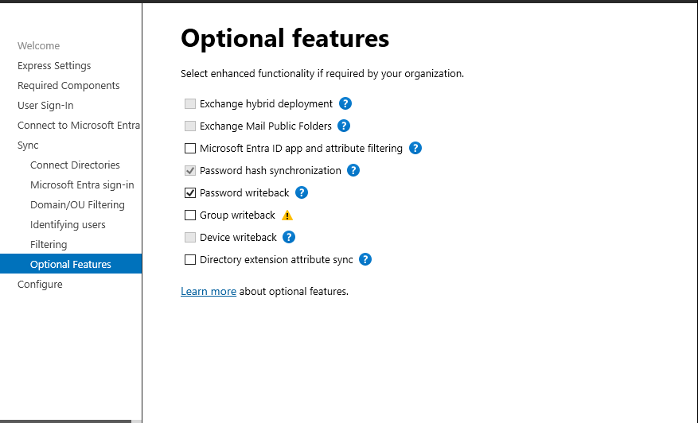
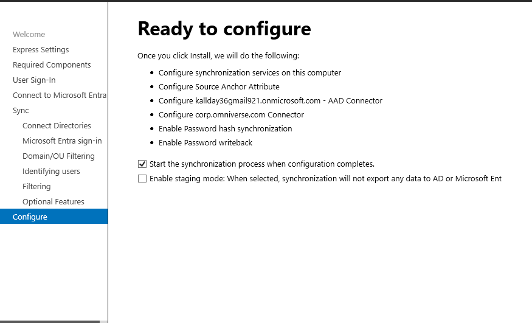
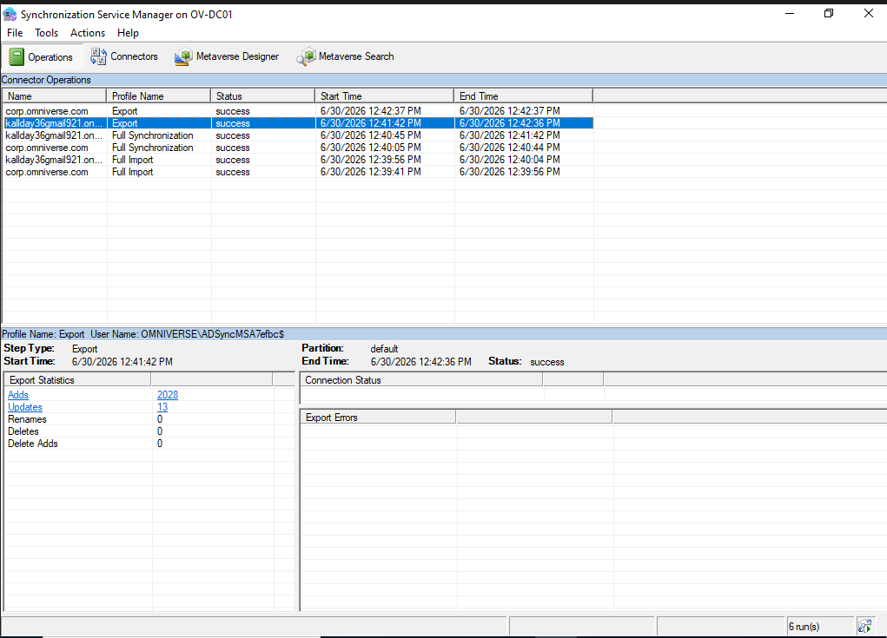
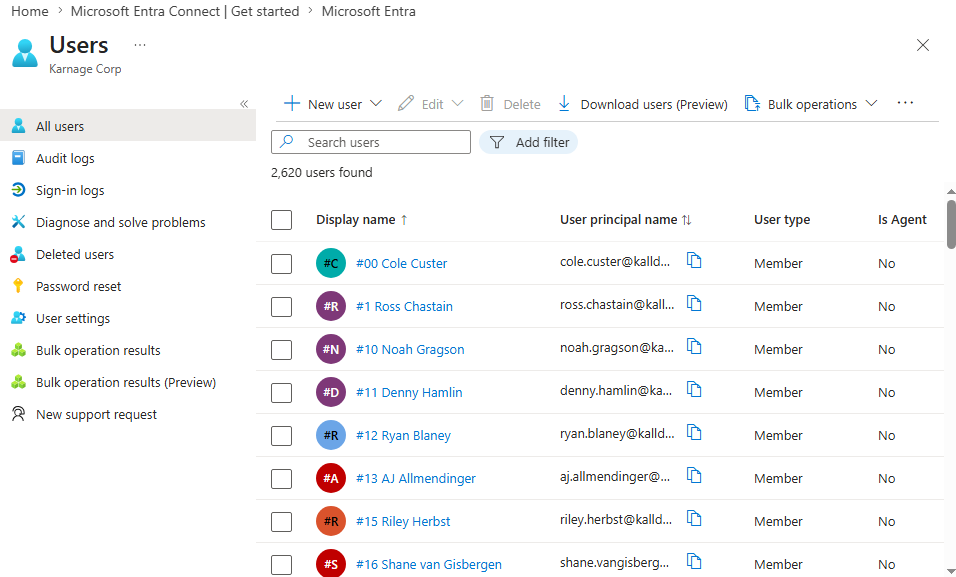
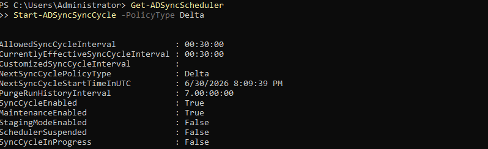

# Hybrid Identity Engineering (IAM-001)

> OmniVerse Enterprise Engineering Portfolio

## Overview

This project documents the deployment, configuration, validation, and operation of a hybrid identity environment using Active Directory, Microsoft Entra ID, and Microsoft Entra Connect.

IAM-001 extends the enterprise Active Directory foundation built in INFRA-001 into Microsoft Entra ID using Password Hash Synchronization, Password Writeback, OU filtering, source anchor configuration, synchronization validation, and PowerShell administration.

## Business Scenario

OmniVerse Enterprises completed its enterprise Active Directory deployment and is preparing to adopt Microsoft 365 cloud services.

To support cloud authentication while maintaining centralized identity management, Microsoft Entra Connect was deployed to synchronize on-premises identities with Microsoft Entra ID.

## Environment

| Component | Value |
|---|---|
| Domain Controller | OV-DC01 |
| Operating System | Windows Server 2022 |
| Active Directory Domain | corp.omniverse.com |
| Microsoft Entra Tenant | kallday36gmail921.onmicrosoft.com |
| Sync Tool | Microsoft Entra Connect |
| Authentication | Password Hash Synchronization |
| Optional Feature | Password Writeback |
| Users | 2,000+ |
| Automation | PowerShell |

## Architecture

```text
Active Directory
        |
        v
Microsoft Entra Connect
        |
        v
Microsoft Entra ID
        |
        v
Microsoft 365 / Cloud Services
```

## Implementation

* Installed Microsoft Entra Connect
* Connected the on-premises Active Directory forest
* Connected the Microsoft Entra tenant
* Configured Password Hash Synchronization
* Configured Password Writeback
* Configured Source Anchor
* Configured OU Filtering
* Completed Initial Synchronization
* Validated Delta Synchronization
* Verified synchronized users in Microsoft Entra ID

## Validation

The following screenshots document the deployment and validation of the hybrid identity environment from installation through synchronization.

---

### Validate the Active Directory Environment

Before deploying Microsoft Entra Connect, the enterprise Active Directory environment was validated to confirm the domain, organizational units, users, and infrastructure were operating correctly.

**Result**

The environment contained over 2,000 Active Directory identities and was ready for hybrid synchronization.



---

### Configure the Authentication Method

Password Hash Synchronization was selected as the primary authentication method.

This allows users to authenticate to Microsoft Entra ID using their existing Active Directory passwords without requiring additional on-premises authentication infrastructure.

**Result**

Password Hash Synchronization was successfully configured.



---

### Connect the Active Directory Forest

The on-premises Active Directory forest was connected to Microsoft Entra Connect using enterprise administrator credentials.

This establishes the synchronization relationship between Active Directory and Microsoft Entra ID.

**Result**

The Active Directory forest was successfully added.



---

### Configure Organizational Unit Filtering

Rather than synchronizing every object in Active Directory, synchronization was limited to selected Organizational Units.

This reduces unnecessary cloud objects while following enterprise synchronization best practices.

**Result**

Only required enterprise objects will synchronize to Microsoft Entra ID.



---

### Configure Identity Matching

Microsoft Entra Connect was configured to use the default source anchor configuration for identity matching.

This enables consistent identity synchronization between Active Directory and Microsoft Entra ID.

**Result**

Identity matching was configured successfully.



---

### Configure Optional Features

Password Writeback was enabled to support future self-service password reset capabilities.

Additional features such as Exchange Hybrid and Device Writeback were intentionally left disabled because they were outside the scope of this project.

**Result**

Optional features were configured successfully.



---

### Review the Final Configuration

Before installation completed, Microsoft Entra Connect presented a summary of the deployment configuration.

This provided one final validation before synchronization began.

**Result**

The deployment configuration was confirmed and applied.



---

### Validate Initial Synchronization

Synchronization Service Manager was used to verify that import, synchronization, and export operations completed successfully.

**Result**

The initial synchronization completed successfully with no critical synchronization errors.



---

### Verify Microsoft Entra ID

After synchronization completed, Microsoft Entra ID was reviewed to verify that Active Directory identities appeared correctly in the cloud tenant.

**Result**

Hybrid identities were successfully synchronized.



---

### Perform Operational Delta Synchronization

A manual Delta Synchronization was initiated using PowerShell to validate operational administration of Microsoft Entra Connect.

```powershell
Start-ADSyncSyncCycle -PolicyType Delta
```

**Result**

The synchronization cycle completed successfully, demonstrating normal operational management of the hybrid identity environment.



## PowerShell Automation

| Script                              | Purpose                                   |
| ----------------------------------- | ----------------------------------------- |
| `Start-DeltaSync.ps1`               | Starts a manual Delta Sync                |
| `Verify-ADSyncScheduler.ps1`        | Validates sync scheduler configuration    |
| `Verify-ADUserHybridAttributes.ps1` | Reviews hybrid identity user attributes   |
| `Get-ImmutableID.ps1`               | Converts ObjectGUID to ImmutableID format |
| `Find-DuplicateUPN.ps1`             | Finds duplicate UPN values                |
| `Find-DuplicateProxyAddresses.ps1`  | Finds duplicate proxyAddresses values     |

## Troubleshooting

### ADSync Module Not Found

During validation, the `Start-ADSyncSyncCycle` command was not initially recognized.

Resolution:

```powershell
Import-Module "C:\Program Files\Microsoft Azure AD Sync\Bin\ADSync\ADSync.psd1"
```

After importing the ADSync module manually, Delta Sync executed successfully.

### UPN Suffix Mismatch

The on-premises UPN suffix `corp.omniverse.com` was not verified in Microsoft Entra ID.

For this lab, synchronization continued using the existing tenant. In production, the preferred approach would be to verify a public domain and standardize UPNs before synchronization.

## Project Structure

```text
hybrid-identity-engineering/
├── diagrams/
├── docs/
├── exports/
├── screenshots/
├── scripts/
└── README.md
```

## Skills Demonstrated

* Hybrid Identity Engineering
* Microsoft Entra Connect
* Microsoft Entra ID
* Active Directory
* Password Hash Synchronization
* Password Writeback
* OU Filtering
* Source Anchor Planning
* Synchronization Service Manager
* PowerShell Automation
* Hybrid Identity Troubleshooting
* Enterprise Documentation

## Project Outcome

Successfully deployed and validated a hybrid identity platform connecting over 2,000 Active Directory identities with Microsoft Entra ID.

This project establishes the foundation for future OmniVerse identity projects including enterprise identity migration, Joiner-Mover-Leaver automation, Conditional Access, Identity Governance, PIM, Microsoft Graph automation, Microsoft Sentinel, and Terraform-based cloud infrastructure.

## Future Enhancements

* IAM-002 Enterprise Identity Migration
* Soft Match and Hard Match
* Microsoft Graph Automation
* Bulk UPN Migration
* Conditional Access
* Identity Governance
* Privileged Identity Management
* Microsoft Sentinel

## Created By

Keshawn Lynch
