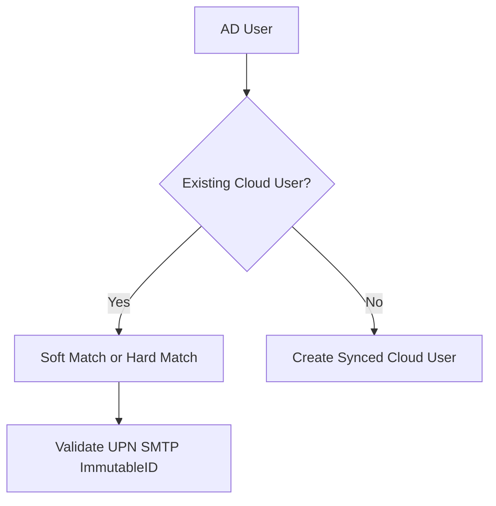

# Identity Matching Flow

```mermaid
flowchart TD
A[AD User] --> B{Existing Cloud User?}
B -- Yes --> C[Soft Match or Hard Match]
B -- No --> D[Create Synced Cloud User]
C --> E[Validate UPN SMTP ImmutableID]
```
